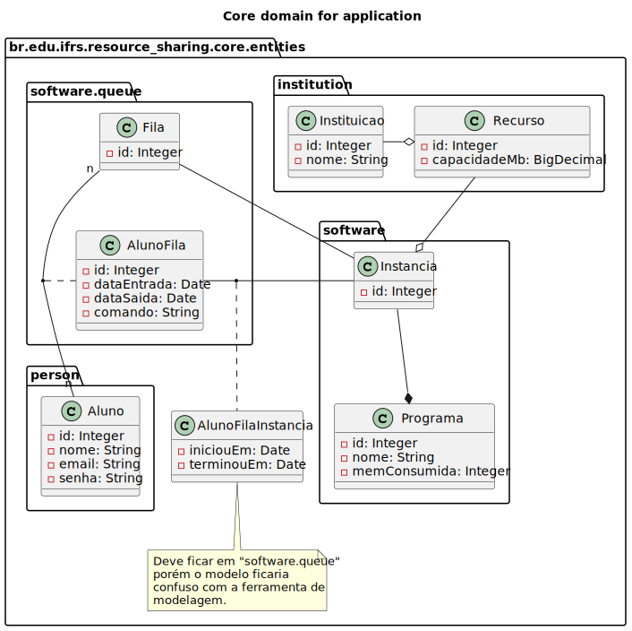

# DB2 Assignment

## Reality
The following application aims to help correct vital problems for distance education: students' lack of structure to 
study remotely.
In view of the main objective, the way in which this application aims to help users is by favoring and simplifying the 
sharing of idle hardware (or program instances) between an institution and its students.
Each instance takes up an amount of memory on the hardware (referred to as a Resource) and can be used by one student at 
a time.
A student can use multiple instances, but to keep the instances busy, it is interesting that multiple students are in a 
queue to use the same instance.
It is necessary to record the capacity of each resource so that it is not consumed more than the capacity of the 
machines.

---
## Domain model

